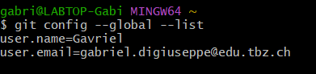
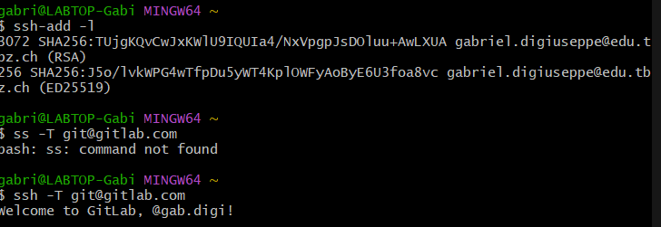
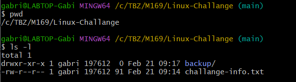
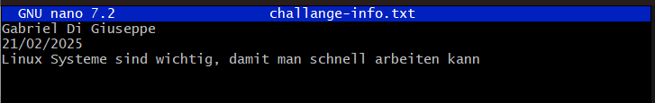
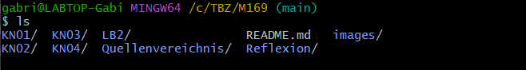
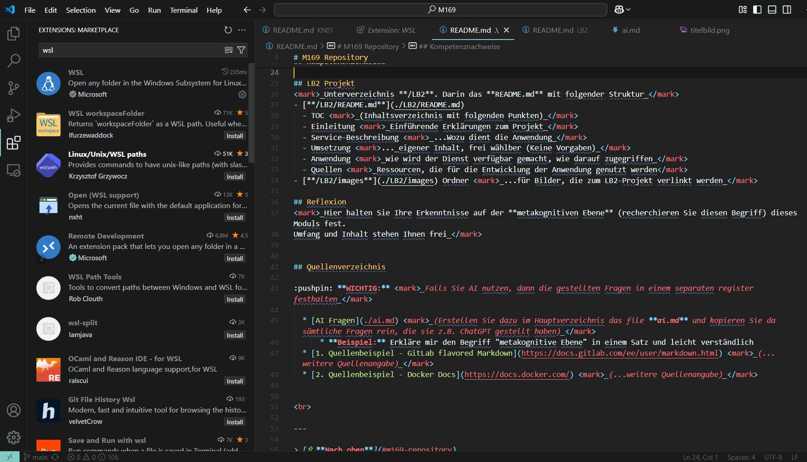
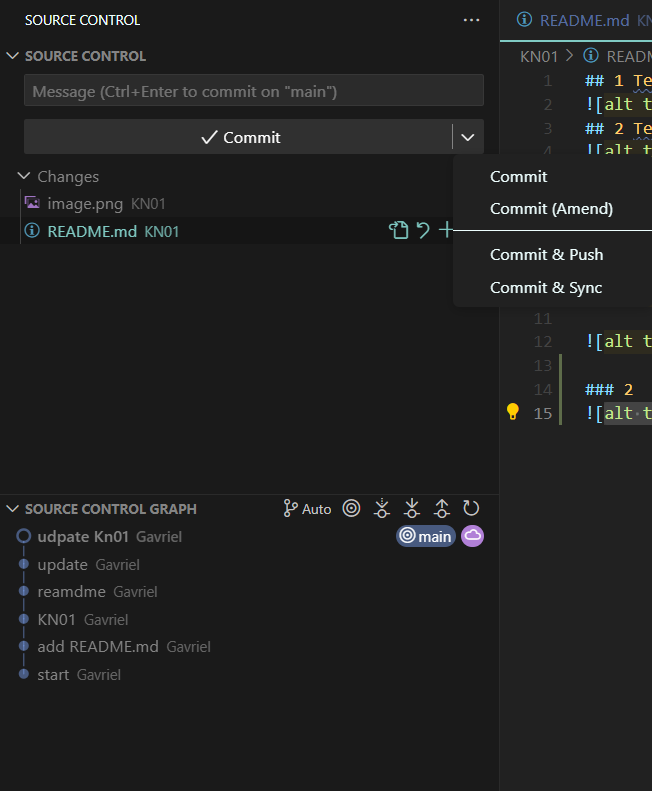

## 1 Teil Leistungsnachweis
git config nachweis

## 2 Teil Leistungsnachweis
SSH-Keys für Github

## 4 Teil Leistungsnachwei
### Teil 1 Bashteil
Der Arbeitspfad

Geöffnete Datei ``challanges-info.txt``

Gelöschtes Verzeichnis ``Linux-Challange``

### Teil 2 VS Codesteil
Hier sind die VsCode Extentions

Hier sieht man die Commands, zum Pushen, Stagen, und man sieht auch noch der Commit-Tree

