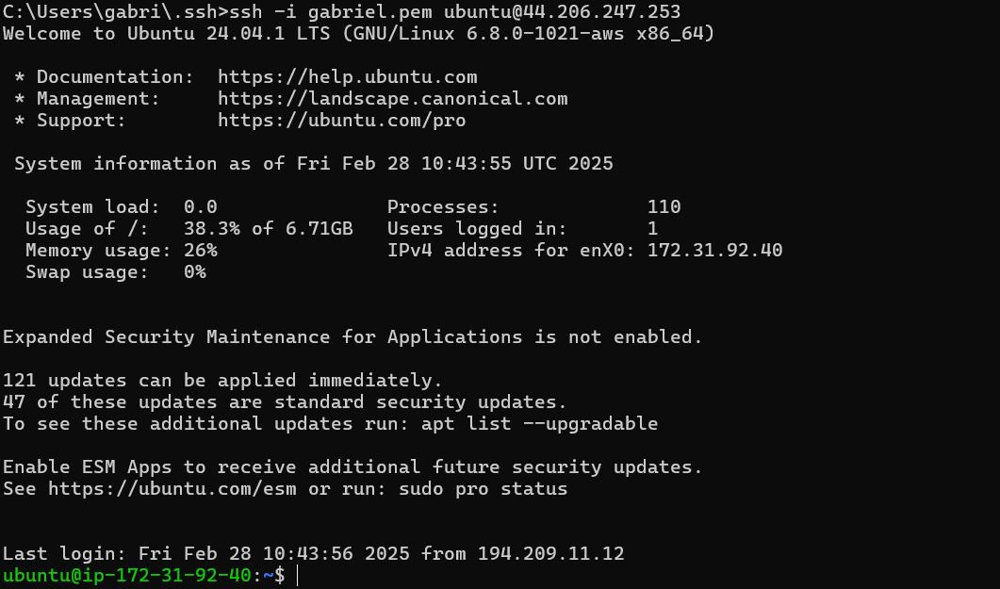
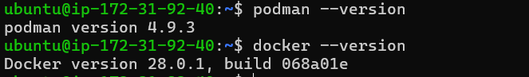
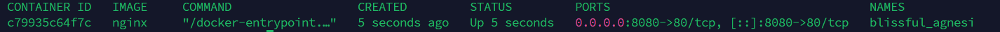
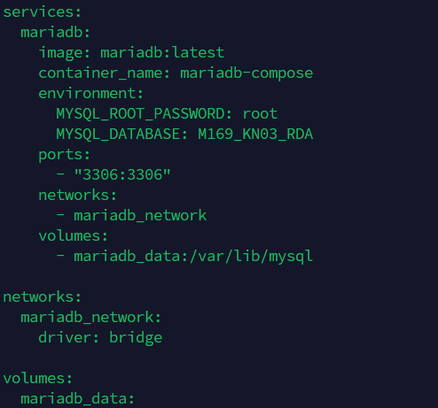
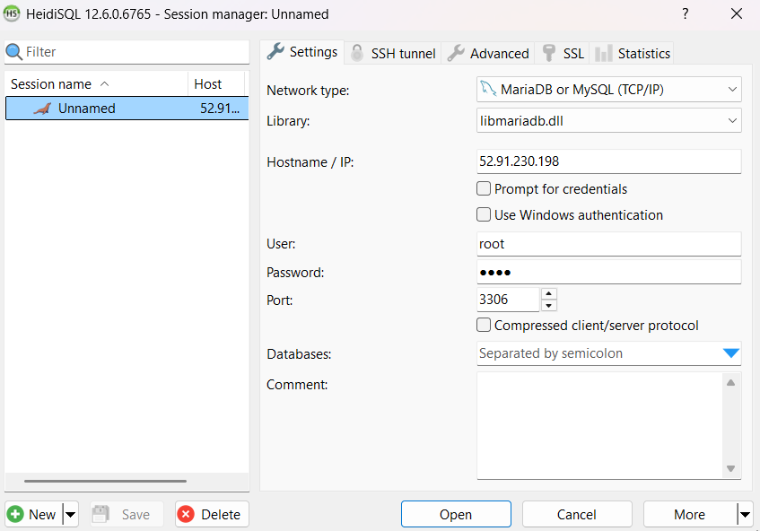
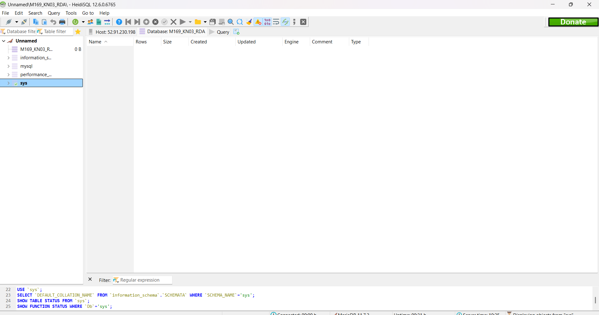

# KN03

## Teil 1

1. Hier habe ich mich mit ssh auf den Ubuntu Server verbunden.

2. Hier sind die Versionen von Docker und Podman auf dem Server

3. **Podman vs Docker**
Docker nutzt einen dauerhaften Daemon (dockerd), um Container zu verwalten.
Podman arbeitet ohne Daemon, Container laufen direkt im Benutzerkontext.
Warum ist der Podman-Dienst inactive?
Podman benötigt keinen ständig laufenden Dienst. Container-Prozesse werden direkt gestartet und laufen unabhängig, was Ressourcen spart.

**Vorteile von Podman**   
   - Sicherer (Rootless-Betrieb)
   - Weniger Ressourcenverbrauch (kein Daemon)
   - Kompatibel mit Docker (gleiche CLI-Befehle)

# Teil 2
### Aufgabe 1
Docker Container anzeigen 
Wenn man ``docker ps -a`` eingibt sieht man folgendes

Hier sieht man welche Container aktiviert sind und welche nicht, und man sieht auch welche Ports geöffnet sind und den Namen des Containers, falls man etwas mit dem Container machen will.

## **Docker Container VS Virtual Machines**
| Docker-Container| Virtuelle Maschine (VM)|
| :----------------------------------------------------------------------------------------- | :------------------------------------------------------------------------------ |
| Container nutzen eine gemeinsame Kernel-Schicht des Host-Systems und sind leichtgewichtig. | VMs emulieren ein vollständiges Betriebssystem mit eigenem Kernel.              |
| Startet innerhalb von Sekunden.                                                            | Braucht mehr Ressourcen und startet langsamer.                                  |
| Nutzt weniger Speicherplatz, da es nur die Anwendung und Abhängigkeiten enthält.           | Enthält ein komplettes OS (z. B. Debian, Ubuntu), was mehr Speicher verbraucht. |
| Container sind portabel, da sie überall laufen, wo Docker installiert ist.                 | VMs müssen für jedes System einzeln konfiguriert werden.                        |

# Teil 3 OCI-Images mit Docker - RUN & ADMINISTRATION 

## Container
Als erster Schritt wird ein Docker-compose file erstellet, da man dort viele Konfigurationen machen kann. Sowie Passwort Datenbank. Und denn freigegebenen Port kann man auch noch eintragen.

Als nächster Schritt den Heidisql Client öffnen. Und die Connection-Credentials eingeben, um mich mit der Datenbank verbinden zu können 

Hier muss man IP-Adresse, Benutzer und Password eintragen, damit man sich verbinden kann und wenn es richtig gemacht wurde kann man sich verbinden

