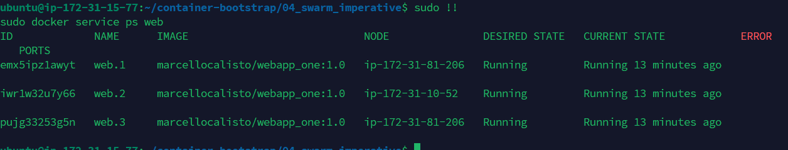

## Teil 1
Hier habe ich das Image erstellt, und auf mein Git-registry gepusht

Hier habe ich die Textfarbe ausversehen verändert anstadt die Hintergrund.

## Teil 2
Docker compose up -d

Docker Compose down -v

images  

Bei der WEbsite habe ich den Text verändert und das Bild auch noch.
Dazu noch sieht man in der URL, das ich auf die Website mit dem Port 5169 gegangen bin.

Hier habe ich noch die einzelnen Netzwerke und Volumes verändert

## Teil 3
Hier sieht man die Manager Nodes, 1 Leader, und 2 die Reachable sind, während die anderen die Worker Nodes sind

### AWS Instaznen

|Node | Zone |
|-----|------|
|Managernode b1 | us-east 1b|
|Workernode b2 | us-east 1b|
|Managernode c1 | us-east 1c|
|Managernde c2 | us-east c1|
|Workernode c3 | us-east c1|

## Teil 4

---
Hier wurde der Service mit dem neuen Port erstellt.

Die anzahl von Container auf 10 erhöht.

Hier habe ich 2 Container in einem Node gelöscht, und wie wurden durch neue erstetzt.

workernode

## Teil 5
Hier sind alle laufende Container im Stack

Hier habe ich die website mit dem Neuen Port aufgerufen

noch ein weiterer Container

Nach update von Replicas sind nur noch 7 aktiv

Hier habe ich noch den Stack removed
