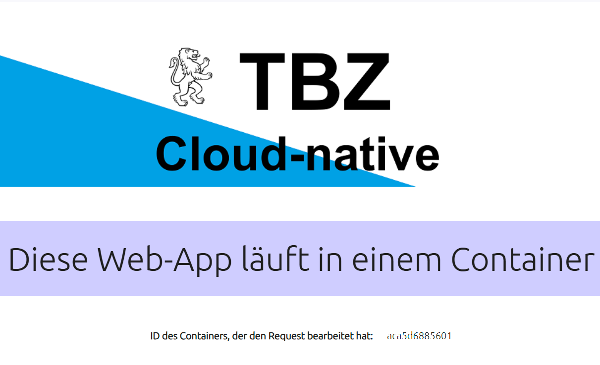

## Teil 1
Hier habe ich das Image erstellt, und auf mein Git-registry gepusht

Hier habe ich die Textfarbe ausversehen verändert anstadt die Hintergrund.

## Teil 2

Bei der WEbsite habe ich den Text verändert und das Bild auch noch.
Dazu noch sieht man in der URL, das ich auf die Website mit dem Port 5169 gegangen bin.

Hier habe ich noch die einzelnen Netzwerke und Volumes verändert

## Teil 3
Hier sieht man die Manager Nodes, 1 Leader, und 2 die Reachable sind, während die anderen die Worker Nodes sind

## Teil 4
### AWS Instaznen

|Node | Zone |
|-----|------|
|Managernode b1 | us-east 1b|
|Workernode b2 | us-east 1b|
|Managernode c1 | us-east 1c|
|Managernde c2 | us-east c1|
|Workernode c3 | us-east c1|
---

workernode

Hier habe ich 2 Container in einem Node gelöscht, und wie wurden durch neue erstetzt.

